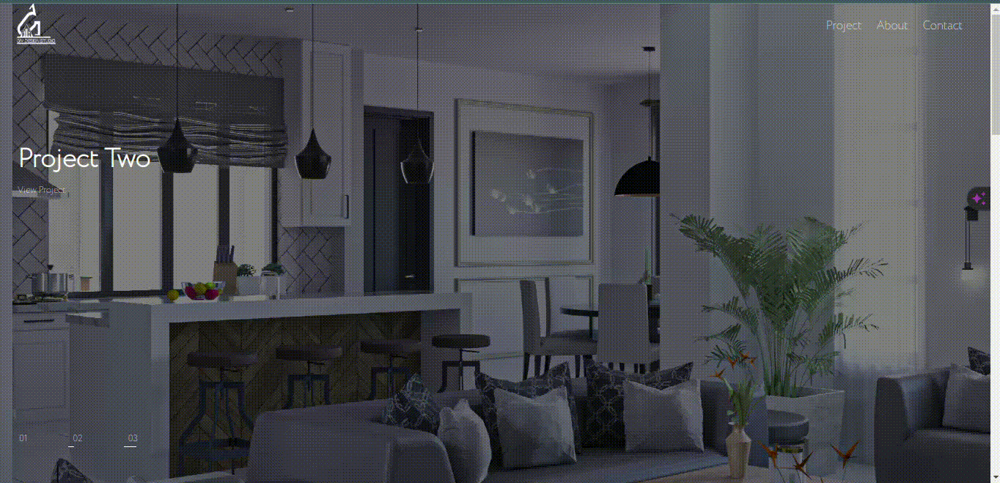
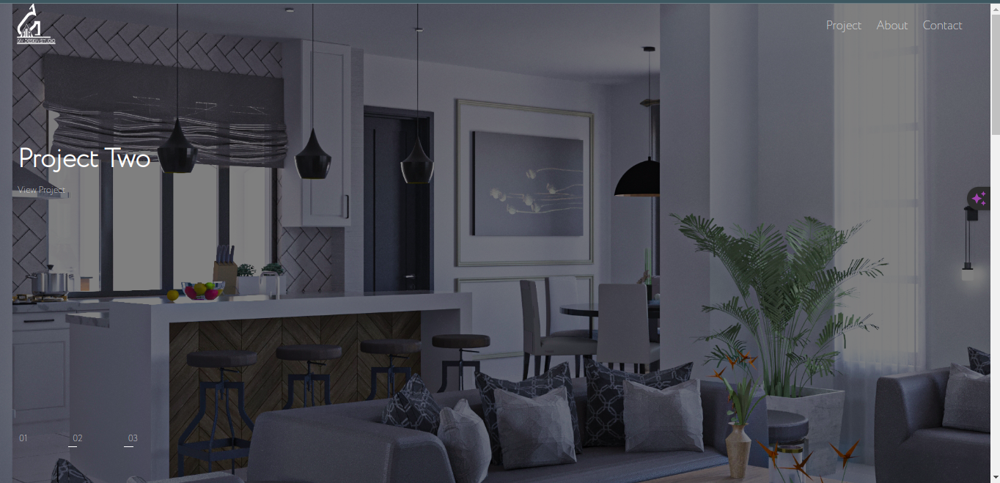
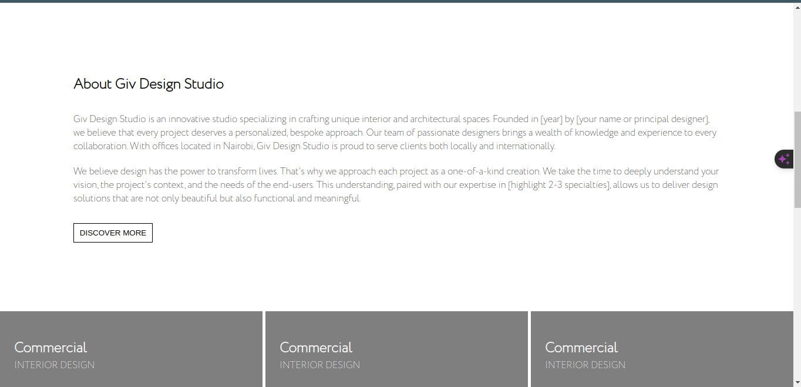
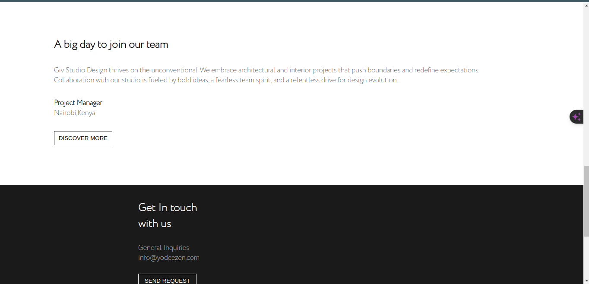
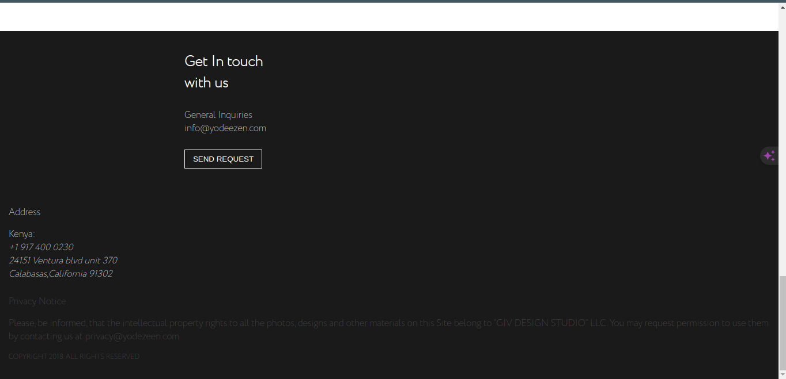

# Nestling Properties Limited

## Overview

Giv architecture Studio is your gateway to exploring cutting-edge architectural architectures and projects. With a keen eye for innovation and functionality, we strive to captivate and inspire our audience through visually striking presentations of our work.

## Key Features

- **Sleek Portfolio Showcase**: Immerse yourself in our diverse portfolio, showcasing a wide array of architectural projects ranging from residential marvels to commercial complexes.

- **Interactive architecture Presentations**: Delve deep into the intricacies of each project with our interactive presentations, featuring captivating visuals and insightful descriptions.

- **Responsive architecture**: Experience seamless browsing across various devices – be it desktops, tablets, or mobile phones – thanks to our website's responsive architecture.

- **Customizable Templates**: Empowering architects and architectureers, we offer customizable templates to craft your own portfolios, allowing you to showcase your work with elegance and style.

## Portfolio Showcase

Take a glimpse into our architectural wonders:

## Demo

Want to experience our platform firsthand? Check out our live demo here [GIV architecture Studio](https://giv-architecture-studio.vercel.app/).

## Getting Started

Embark on your journey with Giv architecture Studio by downloading or cloning this repository. Simply open the `index.html` file in your web browser to navigate through our portfolio and explore different projects using our intuitive user interface.

## Contribution Guidelines

We welcome contributions from fellow architects and architectureers! If you're passionate about architecture and would like to contribute your work or collaborate on projects, please reach out to us at [Giv architecture Studio](mailto:gichanemman95@gmail.com).

## License

This project is licensed under the MIT License. For details, refer to the [LICENSE](LICENSE) file.

## Get in Touch

For inquiries, feedback, or simply to connect, don't hesitate to contact us at [contact@givarchitecturestudio.com](mailto:gichanemman95@gmail.com). We value your input and eagerly anticipate hearing from you!
